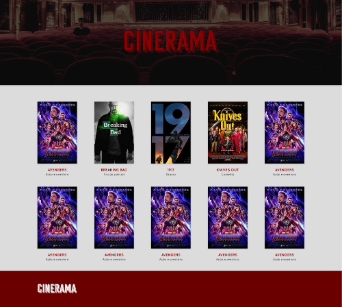

# Projeto Versionamento

## Conteúdos

* [Sobre o projeto](#sobre-o-projeto)
  * [Onde encontrar](#onde-encontrar)
  * [Tecnologias usadas](#tecnologias-usadas)
  * [Estilo](#estilo)
* [Contato](#contato)

## Sobre o projeto

Site catálogo de filmes chamado CINERAMA, desenvolvido como parte da avaliação
da disciplina "Versionamento de código com Git" do curso de pós-graduação em 
[Desenvolvimento Web com Frameworks Modernos](http://cefwm.utfpr.edu.br/) da UTFPR.

### Onde encontrar

O site pode ser encontrado em [cinerama.netlify.app](https://cinerama.netlify.app/).

### Tecnologias usadas

- HTML
- CSS
- JavaScript
- Git

### Estilo

#### Mensagem de commit
As mensagens de _commit_ devem ser concisas e seguir o seguinte padrão:
- Língua: pt-br
- Formato: frase curta que explica a motivação do commit, iniciada com um verbo no imperativo. _Exemplo:_ `adiciona card do filme moonlight`

## Autoras

Amanda Barboza - [@github](https://github.com/amandabrbz) 

Erika Carvalho - [@github](https://github.com/erikacarvalho) 

Victória Maziero - [@github](https://github.com/vmaziero) 
